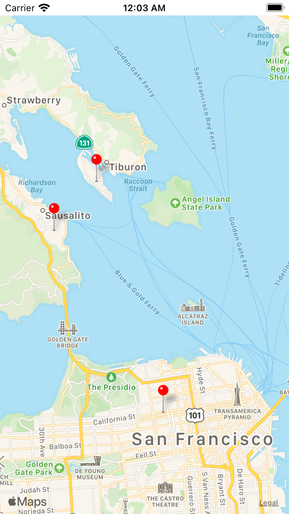

## Virtual Tourist

Virtual Tourist is a app that let the user explore location and look at pictures on those locations. The user can save those pictures on photo album. 
## Installation 

Clone the GitHub repository. 

`$ git clone https://github.com/ryepez/VirtualTourist.git`

## Usage 

### Welcome Screen

### Photos for locations 

