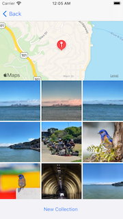

## Virtual Tourist

Virtual Tourist is a app that let the user explore locations and look at pictures on those locations. The user can save and delete those pictures on photo album. The app uses flickr API to get specific photos by latitude and longitude.
## Installation 

Clone the GitHub repository. 

`$ git clone https://github.com/ryepez/VirtualTourist.git`

## Usage 

### Welcome Screen

### Photos for locations 

